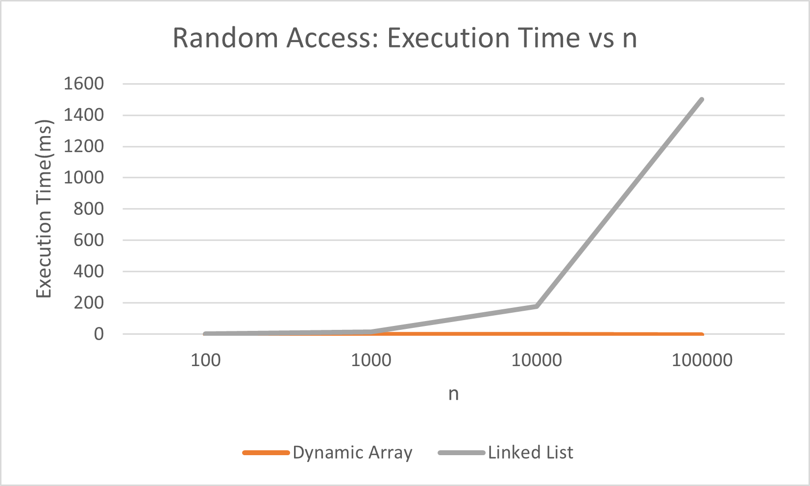
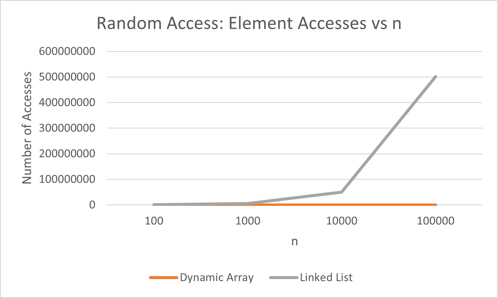

## Assignment 2
## Overview
In this assignment I implemented three data structures in Java:
- Dynamic Array
- Linked List
- Min Heap

The goal was to compare their theoretical complexity with real execution time.

## Complexity Analysis
## Dynamic Array

| Operation | Best | Average | Worst | Space |
|---|---|---|---|---|
| add(x) | Ω(1) | Θ(1) | O(n) | O(n) |
| add(index, x) | Ω(1) | Θ(n) | O(n) | O(n) |
| remove(index) | Ω(1) | Θ(n) | O(n) | O(1) |
| get(index) | Θ(1) | Θ(1) | Θ(1) | O(1) |
| contains(x) | Ω(1) | Θ(n) | O(n) | O(1) |

Dynamic Array is fast for getting elements by index. Insertion and removal can be slower because elements need to be moved.

### Linked List

| Operation | Best | Average | Worst | Space |
|---|---|---|---|---|
| add(x) | Θ(1) | Θ(1) | Θ(1) | O(1) |
| add(index, x) | Ω(1) | Θ(n) | O(n) | O(1) |
| remove(index) | Ω(1) | Θ(n) | O(n) | O(1) |
| get(index) | Ω(1) | Θ(n) | O(n) | O(1) |
| contains(x) | Ω(1) | Θ(n) | O(n) | O(1) |

Linked List is fast for adding and removing at the beginning. Accessing other positions takes longer because nodes are checked one by one.

### Min Heap

| Operation | Best | Average | Worst | Space |
|---|---|---|---|---|
| insert(x) | Ω(1) | Θ(log n) | O(log n) | O(n) |
| peekMin() | Θ(1) | Θ(1) | Θ(1) | O(1) |
| extractMin() | Ω(1) | Θ(log n) | O(log n) | O(1) |

Min Heap keeps the smallest value at the root. Insert and extract can move through the heap, so they can take O(log n).

## Correctness

## Dynamic Array contains()
- Invariant: Before each iteration, all previous elements were checked and none of them were equal to the searched value.
- Initialization: Before the loop no elements were checked, so the invariant is true.
- Maintenance: Each iteration checks one new element. If it is not equal, the loop continues.
- Termination: If the value is found, the method returns true. If the loop ends, all elements were checked and it returns false.

So contains() correctly checks if a value exists.

## Min Heap siftDown()
- Invariant: Before each iteration, the heap is correct except possibly at the current node.
- Initialization: After extractMin(), the last element is moved to the root, so the problem can start there.
- Maintenance: The current element is compared with its children and swapped with the smallest one when needed.
- Termination: The loop stops when there is no smaller child, so the heap property is restored.

So siftDown() correctly restores the Min Heap.

## Experimental Setup
I used these values of n:
- 100
- 1,000
- 10,000
- 100,000

The number of operations was:
- Random Access: m = 10,000
- Search: m = 1,000
- Insertion: m = 1,000
- Removal: m = 1,000
- Min Heap: n insertions and n extractions

Each experiment was repeated 5 times and the average time was used. I used System.nanoTime() and Random(42).
For n = 100, 100 removals were used because the structure only contains 100 elements.

## Results
## Random Access

Dynamic Array was much faster for random access. At n = 100000 it took about 0.011 ms, while Linked List took about 1499.388 ms.

## Search
Both structures needed more time as n increased. At n = 100000, Dynamic Array took about 151.215 ms and Linked List took about 230.577 ms.
They had the same number of comparisons because both check elements one by one.

## Insertion and Removal
Linked List was much faster at the beginning. At n = 100000, beginning insertion took about 0.016 ms for Linked List and 175.123 ms for Dynamic Array.
Dynamic Array has to move elements, while Linked List can change links. Middle operations are slower for Linked List because it first has to reach the correct node.

## Min Heap
Min Heap worked correctly for all sizes. At n = 100000, insertion took about 3.027 ms and extraction took about 18.809 ms.
All extracted values were in non-decreasing order and sorted=true.
Full benchmark results are available in results/tables.

## Discussion
The results mostly matched the theoretical complexity.
Dynamic Array was much faster for random access because get() is O(1), while Linked List has to move through nodes.
Both structures have O(n) search, but their real times were different. This shows that the same Big-O does not always mean the same execution time.
Linked List worked well for operations at the beginning, while Dynamic Array was better for direct access.
Min Heap was useful when the minimum value had to be accessed and removed repeatedly.

## Design Recommendations
I would use Dynamic Array when fast index access is important.
I would use Linked List when there are many insertions or removals at the beginning.
I would use Min Heap when I need to repeatedly get the smallest value.

## Conclusion
This assignment showed that the choice of data structure depends on the workload. The experimental results were mostly similar to the theoretical complexity, but actual execution times were still different between implementations.